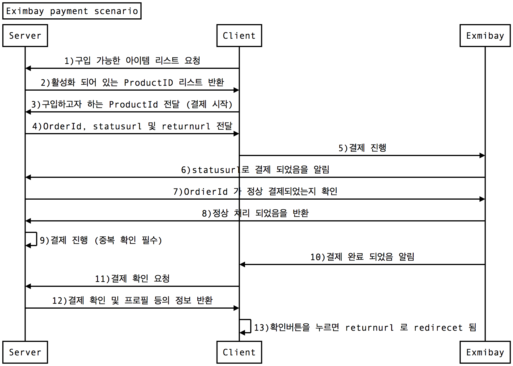

# eximbay
> eximbay module for Node.js.

- eximbay 개발사와 저는 전혀 상관 없으며, 이용 중 발생한 문제에 대해 책임지지 않습니다.
- Backend (Server) 작업을 위해 생성한 패키지 이므로, Frontend (Client) 쪽은 크게 고려하지 않고 만들었습니다.


## Remark

아래 Sequence 도식을 가정하고 작업합니다.



* 이 모듈은 아래의 순서와 관련된 **일부** 내용만 구현합니다.
  * Client :  5)
  * Server : 7)


## 설치
```bash
npm i --save eximbay
```


## 기능

### Client

1. 결제

### Server

1. 유효한 결제인지 검증
